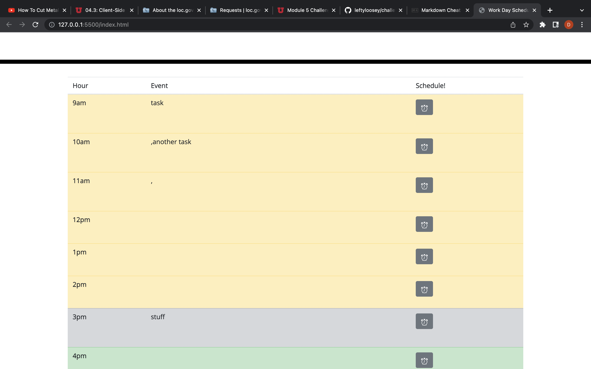

# University of Utah Coding Bootcamp Challenge #5

## Welcome

### This 
is a work scheduling app. It displays the hours of the day from 9am to 5pm. The
row for the current hour is gray, previous yellow, and future hours are green. 
A user can assign tasks to each hour, and those tasks are assigned to local 
storage. Dates and times are supplied by momentjs.

This one was actually fairly straightforward to write. I'd like to have managed it
with even fewer lines, but this was clean as I could make it.

### Link:

[repo](https://leftyloosey.github.io)

### Screenshot:

